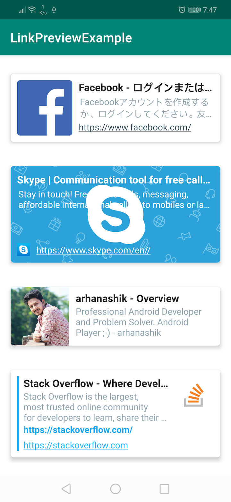
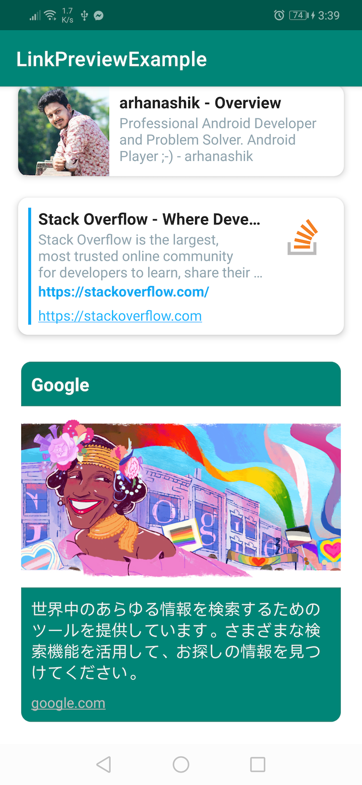
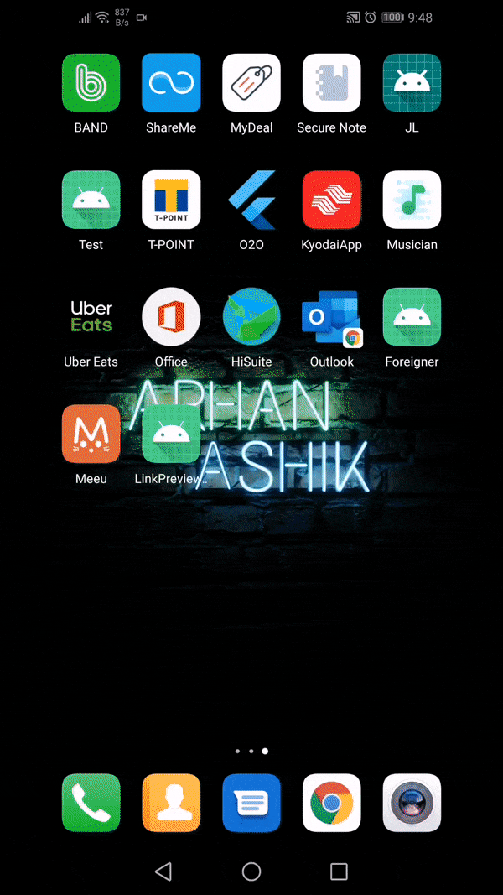

# LinkPreview

An android library to add preview for any url in any android application. This library uses the
latest kotlin language including **coroutine**, **coil** and google's **material** design library.

[](https://jitpack.io/#arhanashik/LinkPreview)


## Preview
|Screenshot_v1.0.0|Screenshot_v1.1.0|Preview|
|---|---|---|
||||

## Setup
**Step 1:** Add it in your root build.gradle at the end of repositories:
```
allprojects {
    repositories {
        ...
        maven { url 'https://jitpack.io' }
    }
}
```
Add the dependency:
```
implementation 'com.github.arhanashik:LinkPreview:1.0.0'
```
**Step 2:** You need to add Java 8 support(Necessary for coil):
```
android {
    ...
    compileOptions {
        sourceCompatibility JavaVersion.VERSION_1_8
        targetCompatibility JavaVersion.VERSION_1_8
    }
}
```
**Step 3:** Add Google's **material** design library:
```
implementation 'com.google.android.material:material:1.3.0-alpha01'
```
Update **res->values->style.xml** file. Replace base application theme with the following:
```
<!-- Base application theme. -->
<style name="AppTheme" parent="Theme.MaterialComponents.Light.DarkActionBar">
    <!-- Customize your theme here. -->
    <item name="colorPrimary">@color/colorPrimary</item>
    <item name="colorPrimaryDark">@color/colorPrimaryDark</item>
    <item name="colorAccent">@color/colorAccent</item>
</style>
```
That's it. You are good to go!
## How to use
Add **LinkPreview** widget in XML
```
<com.workfort.linkpreview.LinkPreview
    android:id="@+id/linkPreview"
    android:layout_width="match_parent"
    android:layout_height="wrap_content"
    app:url="https://stackoverflow.com" />
```
You can change the url at runtime
```
linkPreview.load("your-url")
```
You can also add a callback(optional):
```
linkPreview.load(url, object: LinkViewCallback {
    override fun onSuccess(data: MetaData) {
        Log.d("LinkPreview", "Loaded: $url")
    }

    override fun onError(exception: Exception) {
        exception.printStackTrace()
    }
})
```
For changing the view use `app:previewStyle`:
```
<com.workfort.linkpreview.LinkPreview
    android:id="@+id/linkPreview"
    android:layout_width="match_parent"
    android:layout_height="wrap_content"
    app:url="https://facebook.com"
    app:previewStyle="banner" />
```
When clicked on the link, by default the library opens the link on a browser. For handling the click event:
```
linkPreview.setClickListener(object: LinkClickListener {
    override fun onClick(view: View, metaData: MetaData) {
        //Customise the click action
    }
})
```
By overriding the click listener the default click action will be disabled.

## Parameters in xml
|name|value|description|
|---|---|---|
|app:url|string|Url to preview. Default is empty.|
|app:previewStyle|simple/banner/strip/details/large|View for the LinkPreview widget.|
|app:enableDefaultClick|boolean|Open the link if clicked. True by default.|
|app:borderRadius|dimension|Corner radius of the background. Default 10dp|
|app:shadow|dimension|Elevation of the card. Default 5dp|
|app:backgroundColor|color|Background of the card.(Only for the large style. Default Black)|

## Advance
1. If you want to use your own preview, use the following callback:
```
LinkParser(url, object : ParserCallback {
    override fun onData(metaData: MetaData) {
        //Use metaData to get title, image, description etc
        //and set that to your custom view
    }

    override fun onError(exception: Exception) {
        //Handle the exception here
    }
}).parse()
```
2. If you want to customize the data shown in the built in view, change the **metaData** and update LinkPreview:
```
linkPreview.loadFromMetaData(your-MetaData-here)
```

## Others
For more information please check the sample project.
The library is free to use. If you wish to improve it, please create a separate branch and make pull request.

## Changelog:
### 1.0.0
------------
Preview style: simple/banner/strip/details

### 1.1.0
------------
New Preview style: large.

New attributes: borderRadius, shadow, backgroundColor


## Thanks!
Thank you for reading and using the library!

## Inspiration
[RichLinkPreview](https://github.com/PonnamKarthik/RichLinkPreview)

## Contact
For any question or suggestion feel free to send an email:
**ashik.pstu.cse@gmail.com**

## License
                                 Apache License
                           Version 2.0, January 2004
                        http://www.apache.org/licenses/
